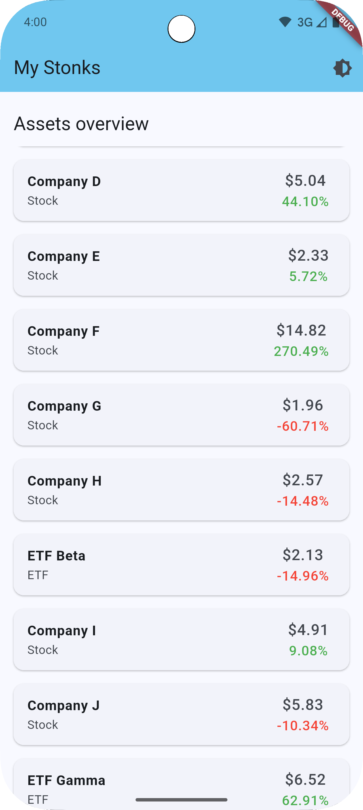
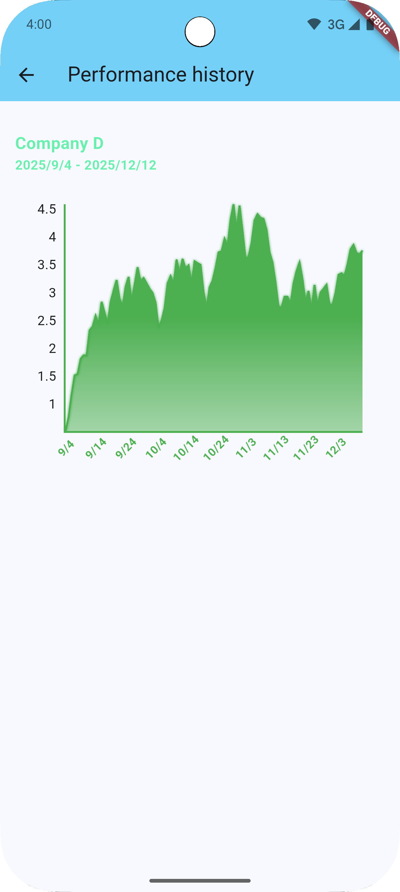
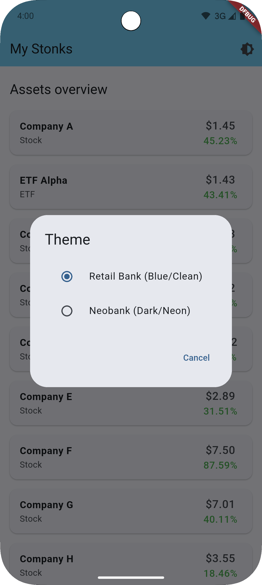
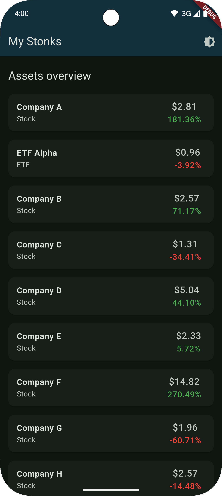
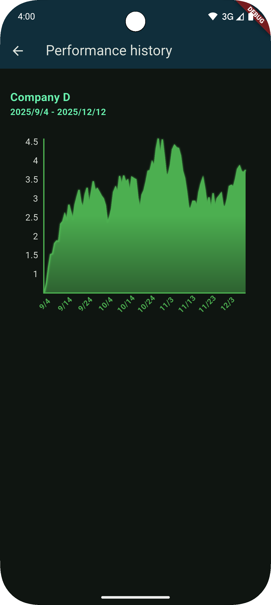
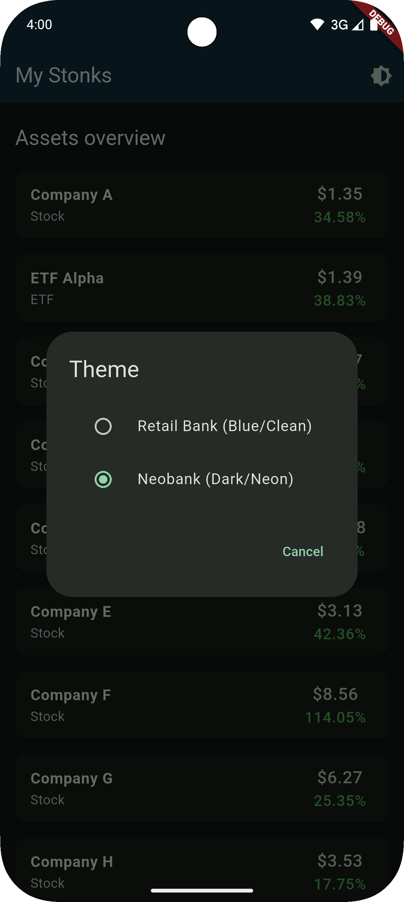

# my_stonks

**my_stonks** is a financial portfolio overview app built with Flutter, aimed at providing users with insights into their investment assets like stocks and ETFs. The application leverages gRPC for data communication between the frontend and the backend and provides visually engaging performance charts for a better user experience.

---

## Screenshots

|  |  |  |
|-----------------------------------------------------------------------|-----------------------------------------------------------------------------|----------------------------------------------------------------------------|
|          |      |      |
| **Portfolio List**                                                    | **Performance Chart**                                                       | **Theme Switch**                                                           |
| View a comprehensive list of assets.                                  | Interactive chart visualizing performance over time.                        | Toggle between "Retail Bank" and "Neobank" themes.                         |

---

## Table of Contents

- [Features](#features)
- [Installation](#installation)
- [Usage](#usage)
- [Architecture](#architecture)
- [Tools used](#tools-used)
- [Testing](#testing)

---

## Features

- **Portfolio List**: View a comprehensive list of financial assets with current prices and percentage changes.
- **Performance Chart**: Interactive charts to visualize portfolio performance over time.
- **Theme Switch**: Toggle between "Retail Bank" and "Neobank" themes for a personalized experience.
- **State Management**: Robust state management to handle loading, loaded, and error states.

---

## Installation

### Backend

Before you proceed, ensure you have [dart](https://dart.dev/) installed on your machine.

1. Navigate to the `server` directory:
    ```bash
    cd server
    ```
2. Install the dart dependencies:
   ```
   dart pub get
   ```

### Frontend

Before you proceed, ensure you have [Flutter](https://flutter.dev/) installed on your machine.

1. Navigate to the `apps/my_stonks_flutter` directory:
    ```bash
    cd apps/my_stonks_flutter
    ```
2. Install Flutter dependencies:
    ```bash
   flutter pub get
    ```

---

## Running the App

### Backend

1. Start the server
   ```
   cd server
   dart bin/server.dart
   ```
2. Start the realtime update simulator
   ```
   dart bin/realtime_updates_simulator.dart
   ```

### Frontend

1. Launch an Android emulator
   ```
   flutter emulators
   emulator -avd <Your_AVD_Name>
   ```
2. Run the app
    ```bash
   flutter run lib/main_development.dart
    ```

---

## Usage

Upon running the app, you can view the portfolio list and toggle between themes. The application fetches test data from the backend, which simulates asset information.

Interact with the performance chart to see your portfolio's value over time. Ensure the backend service is running to fetch live data, as the app relies on it for displaying accurate information.

---

## Architecture

The project is structured into two main directories:
- **apps/my_stonks_flutter**: Contains the Flutter app for the frontend.
- **server**: Contains the gRPC server handling data requests and responses.

---

## Tools used

- **[very_good_cli](https://cli.vgv.dev/) and [flutter_bloc](https://bloclibrary.dev/)**: Clean, readable code structured for production.
- **[grpc](https://pub.dev/packages/grpc) and [protobuf](https://pub.dev/packages/protobuf)**: gRPC and protos used to define data models.
- Theme switch implemented to toggle between "Retail Bank" (Blue/Clean) and "Neobank" (Dark/Neon) themes.

---

## Testing

Before you proceed, ensure you have [very_good_cli](https://cli.vgv.dev/) installed on your machine.

To run tests, navigate to the frontend directory and execute:
```
cd apps/my_stonks_flutter
very_good test --coverage --test-randomize-ordering-seed random
```
